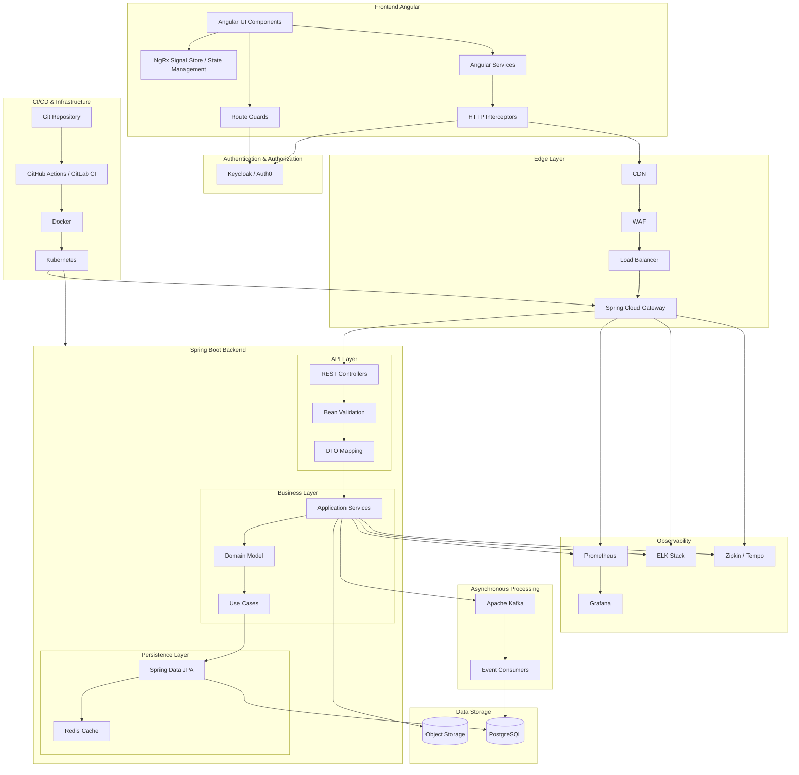

```mermaid
flowchart TB

    %% =========================
    %% FRONTEND
    %% =========================
    subgraph CLIENT["Frontend Angular"]
        UI[Angular UI Components]
        STATE[NgRx Signal Store / State Management]
        GUARDS[Route Guards]
        INTERCEPTOR[HTTP Interceptors]
        SERVICES[Angular Services]
    end

    %% =========================
    %% SECURITY
    %% =========================
    subgraph AUTH["Authentication & Authorization"]
        KEYCLOAK[Keycloak / Auth0]
    end

    %% =========================
    %% EDGE LAYER
    %% =========================
    subgraph EDGE["Edge Layer"]
        CDN[CDN]
        LB[Load Balancer]
        APIGW[Spring Cloud Gateway]
        WAF[WAF]
    end

    %% =========================
    %% BACKEND
    %% =========================
    subgraph BACKEND["Spring Boot Backend"]
        
        subgraph API["API Layer"]
            CONTROLLERS[REST Controllers]
            DTO[DTO Mapping]
            VALIDATION[Bean Validation]
        end

        subgraph BUSINESS["Business Layer"]
            SERVICES_B[Application Services]
            DOMAIN[Domain Model]
            USECASES[Use Cases]
        end

        subgraph DATA["Persistence Layer"]
            REPOSITORIES[Spring Data JPA]
            CACHE[Redis Cache]
        end

    end

    %% =========================
    %% DATABASE
    %% =========================
    subgraph STORAGE["Data Storage"]
        POSTGRES[(PostgreSQL)]
        S3[(Object Storage)]
    end

    %% =========================
    %% ASYNC
    %% =========================
    subgraph ASYNC["Asynchronous Processing"]
        KAFKA[Apache Kafka]
        CONSUMERS[Event Consumers]
    end

    %% =========================
    %% OBSERVABILITY
    %% =========================
    subgraph OBS["Observability"]
        PROM[Prometheus]
        GRAFANA[Grafana]
        ELK[ELK Stack]
        ZIPKIN[Zipkin / Tempo]
    end

    %% =========================
    %% DEVOPS
    %% =========================
    subgraph DEVOPS["CI/CD & Infrastructure"]
        GIT[Git Repository]
        PIPELINE[GitHub Actions / GitLab CI]
        DOCKER[Docker]
        K8S[Kubernetes]
    end

    %% =========================
    %% FRONT FLOW
    %% =========================
    UI --> STATE
    UI --> GUARDS
    UI --> SERVICES
    SERVICES --> INTERCEPTOR

    %% =========================
    %% AUTH FLOW
    %% =========================
    GUARDS --> KEYCLOAK
    INTERCEPTOR --> KEYCLOAK

    %% =========================
    %% API FLOW
    %% =========================
    INTERCEPTOR --> CDN
    CDN --> WAF
    WAF --> LB
    LB --> APIGW

    APIGW --> CONTROLLERS
    CONTROLLERS --> VALIDATION
    VALIDATION --> DTO
    DTO --> SERVICES_B

    SERVICES_B --> DOMAIN
    DOMAIN --> USECASES
    USECASES --> REPOSITORIES

    %% =========================
    %% DATA FLOW
    %% =========================
    REPOSITORIES --> CACHE
    REPOSITORIES --> POSTGRES
    SERVICES_B --> S3

    %% =========================
    %% EVENTS
    %% =========================
    SERVICES_B --> KAFKA
    KAFKA --> CONSUMERS
    CONSUMERS --> POSTGRES

    %% =========================
    %% MONITORING
    %% =========================
    APIGW --> PROM
    SERVICES_B --> PROM

    APIGW --> ELK
    SERVICES_B --> ELK

    APIGW --> ZIPKIN
    SERVICES_B --> ZIPKIN

    PROM --> GRAFANA

    %% =========================
    %% DEPLOYMENT
    %% =========================
    GIT --> PIPELINE
    PIPELINE --> DOCKER
    DOCKER --> K8S

    K8S --> APIGW
    K8S --> BACKEND
```
