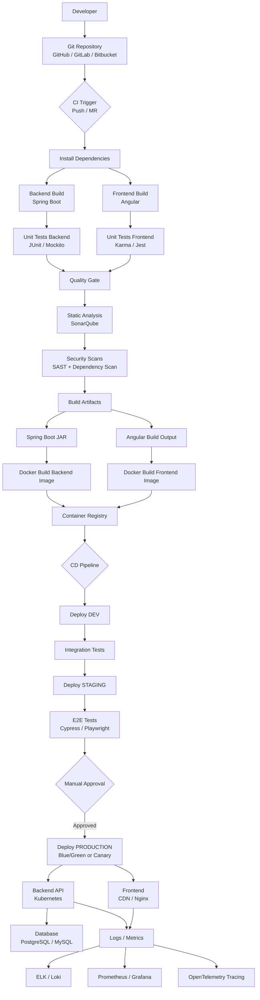

```mermaid
flowchart TD

%% =====================
%% SOURCE CONTROL
%% =====================
A[Developer] --> B[Git Repository<br/>GitHub / GitLab / Bitbucket]

B --> C{CI Trigger<br/>Push / MR}

%% =====================
%% CI PIPELINE
%% =====================
C --> D[Install Dependencies]

D --> E1[Frontend Build<br/>Angular]
D --> E2[Backend Build<br/>Spring Boot]

E1 --> F1[Unit Tests Frontend<br/>Karma / Jest]
E2 --> F2[Unit Tests Backend<br/>JUnit / Mockito]

F1 --> G[Quality Gate]
F2 --> G

G --> H[Static Analysis<br/>SonarQube]

H --> I[Security Scans<br/>SAST + Dependency Scan]

I --> J[Build Artifacts]

%% =====================
%% ARTIFACTS + DOCKER
%% =====================
J --> K1[Angular Build Output]
J --> K2[Spring Boot JAR]

K1 --> L[Docker Build Frontend Image]
K2 --> M[Docker Build Backend Image]

L --> N[Container Registry]
M --> N

%% =====================
%% CD PIPELINE
%% =====================
N --> O{CD Pipeline}

O --> P1[Deploy DEV]
P1 --> Q1[Integration Tests]

Q1 --> P2[Deploy STAGING]
P2 --> Q2[E2E Tests<br/>Cypress / Playwright]

Q2 --> P3{Manual Approval}

P3 -->|Approved| P4[Deploy PRODUCTION<br/>Blue/Green or Canary]

%% =====================
%% RUNTIME
%% =====================
P4 --> R1[Frontend<br/>CDN / Nginx]
P4 --> R2[Backend API<br/>Kubernetes]

R2 --> S[Database<br/>PostgreSQL / MySQL]

%% =====================
%% OBSERVABILITY
%% =====================
R1 --> T1[Logs / Metrics]
R2 --> T1

T1 --> U1[ELK / Loki]
T1 --> U2[Prometheus / Grafana]
T1 --> U3[OpenTelemetry Tracing]
```
