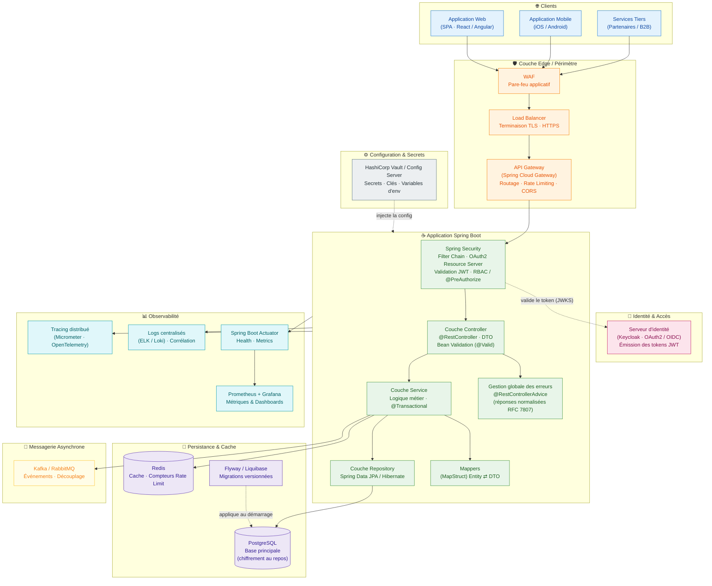

```mermaid
flowchart TB
    %% ===================== CLIENTS =====================
    subgraph CLIENTS["🌐 Clients"]
        WEB["Application Web<br/>(SPA · React / Angular)"]
        MOBILE["Application Mobile<br/>(iOS / Android)"]
        EXT["Services Tiers<br/>(Partenaires / B2B)"]
    end

    %% ===================== EDGE / PÉRIMÈTRE =====================
    subgraph EDGE["🛡️ Couche Edge / Périmètre"]
        WAF["WAF<br/>Pare-feu applicatif"]
        LB["Load Balancer<br/>Terminaison TLS · HTTPS"]
        GW["API Gateway<br/>(Spring Cloud Gateway)<br/>Routage · Rate Limiting · CORS"]
    end

    %% ===================== AUTHENTIFICATION =====================
    subgraph AUTH["🔐 Identité & Accès"]
        IDP["Serveur d'identité<br/>(Keycloak · OAuth2 / OIDC)<br/>Émission des tokens JWT"]
    end

    %% ===================== APPLICATION SPRING BOOT =====================
    subgraph APP["☕ Application Spring Boot"]
        direction TB
        SEC["Spring Security<br/>Filter Chain · OAuth2 Resource Server<br/>Validation JWT · RBAC / @PreAuthorize"]
        CTRL["Couche Controller<br/>@RestController · DTO<br/>Bean Validation (@Valid)"]
        EXC["Gestion globale des erreurs<br/>@RestControllerAdvice<br/>(réponses normalisées RFC 7807)"]
        SVC["Couche Service<br/>Logique métier · @Transactional"]
        MAP["Mappers<br/>(MapStruct) Entity ⇄ DTO"]
        REPO["Couche Repository<br/>Spring Data JPA / Hibernate"]
    end

    %% ===================== PERSISTANCE & CACHE =====================
    subgraph DATA["💾 Persistance & Cache"]
        DB[("PostgreSQL<br/>Base principale<br/>(chiffrement au repos)")]
        CACHE[("Redis<br/>Cache · Compteurs Rate Limit")]
        MIG["Flyway / Liquibase<br/>Migrations versionnées"]
    end

    %% ===================== ASYNCHRONE =====================
    subgraph ASYNC["📨 Messagerie Asynchrone"]
        BROKER["Kafka / RabbitMQ<br/>Événements · Découplage"]
    end

    %% ===================== OBSERVABILITÉ =====================
    subgraph OBS["📊 Observabilité"]
        ACT["Spring Boot Actuator<br/>Health · Metrics"]
        PROM["Prometheus + Grafana<br/>Métriques & Dashboards"]
        LOG["Logs centralisés<br/>(ELK / Loki) · Corrélation"]
        TRACE["Tracing distribué<br/>(Micrometer · OpenTelemetry)"]
    end

    %% ===================== CONFIG & SECRETS =====================
    subgraph CONF["⚙️ Configuration & Secrets"]
        VAULT["HashiCorp Vault / Config Server<br/>Secrets · Clés · Variables d'env"]
    end

    %% ===================== FLUX PRINCIPAUX =====================
    WEB --> WAF
    MOBILE --> WAF
    EXT --> WAF
    WAF --> LB
    LB --> GW
    GW --> SEC

    SEC -. "valide le token (JWKS)" .-> IDP
    SEC --> CTRL
    CTRL --> EXC
    CTRL --> SVC
    SVC --> MAP
    SVC --> REPO
    SVC --> CACHE
    SVC --> BROKER
    REPO --> DB
    MIG -. "applique au démarrage" .-> DB

    %% ===================== FLUX TRANSVERSAUX =====================
    APP --> ACT
    ACT --> PROM
    APP --> LOG
    APP --> TRACE
    VAULT -. "injecte la config" .-> APP

    %% ===================== STYLES =====================
    classDef client fill:#E3F2FD,stroke:#1976D2,stroke-width:1px,color:#0D47A1
    classDef edge fill:#FFF3E0,stroke:#F57C00,stroke-width:1px,color:#E65100
    classDef auth fill:#FCE4EC,stroke:#C2185B,stroke-width:1px,color:#880E4F
    classDef app fill:#E8F5E9,stroke:#388E3C,stroke-width:1px,color:#1B5E20
    classDef data fill:#EDE7F6,stroke:#5E35B1,stroke-width:1px,color:#311B92
    classDef async fill:#FFFDE7,stroke:#FBC02D,stroke-width:1px,color:#F57F17
    classDef obs fill:#E0F7FA,stroke:#0097A7,stroke-width:1px,color:#006064
    classDef conf fill:#ECEFF1,stroke:#546E7A,stroke-width:1px,color:#263238

    class WEB,MOBILE,EXT client
    class WAF,LB,GW edge
    class IDP auth
    class SEC,CTRL,EXC,SVC,MAP,REPO app
    class DB,CACHE,MIG data
    class BROKER async
    class ACT,PROM,LOG,TRACE obs
    class VAULT conf
```
