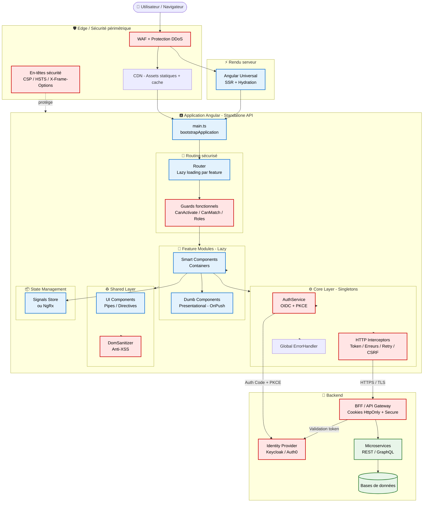

```mermaid
flowchart TB
    User([👤 Utilisateur / Navigateur])

    subgraph Edge["🛡️ Edge / Sécurité périmétrique"]
        WAF[WAF + Protection DDoS]
        CDN[CDN - Assets statiques + cache]
        Headers[En-têtes sécurité<br/>CSP / HSTS / X-Frame-Options]
    end

    subgraph SSR["⚡ Rendu serveur"]
        Universal[Angular Universal<br/>SSR + Hydration]
    end

    subgraph App["🅰️ Application Angular - Standalone API"]
        Bootstrap[main.ts<br/>bootstrapApplication]

        subgraph Routing["🧭 Routing sécurisé"]
            Router[Router<br/>Lazy loading par feature]
            Guards[Guards fonctionnels<br/>CanActivate / CanMatch / Roles]
        end

        subgraph Core["⚙️ Core Layer - Singletons"]
            AuthSvc[AuthService<br/>OIDC + PKCE]
            Interceptors[HTTP Interceptors<br/>Token / Erreurs / Retry / CSRF]
            ErrHandler[Global ErrorHandler]
        end

        subgraph Features["🧩 Feature Modules - Lazy"]
            Smart[Smart Components<br/>Containers]
            Dumb[Dumb Components<br/>Presentational - OnPush]
        end

        subgraph Shared["♻️ Shared Layer"]
            UI[UI Components<br/>Pipes / Directives]
            Sanitizer[DomSanitizer<br/>Anti-XSS]
        end

        subgraph State["📦 State Management"]
            Signals[Signals Store<br/>ou NgRx]
        end
    end

    subgraph BackendLayer["🔧 Backend"]
        BFF[BFF / API Gateway<br/>Cookies HttpOnly + Secure]
        IdP[Identity Provider<br/>Keycloak / Auth0]
        API[Microservices<br/>REST / GraphQL]
        DB[(Bases de données)]
    end

    User --> WAF
    WAF --> CDN
    WAF --> Universal
    CDN --> Bootstrap
    Universal --> Bootstrap
    Headers -. protège .-> App

    Bootstrap --> Router
    Router --> Guards
    Guards --> Features
    Features --> Smart
    Smart --> Dumb
    Smart --> Signals
    Smart --> Core
    Features --> Shared
    Shared --> Sanitizer

    Core --> AuthSvc
    Core --> Interceptors
    Core --> ErrHandler

    Interceptors -->|HTTPS / TLS| BFF
    AuthSvc -->|Auth Code + PKCE| IdP
    BFF -->|Validation token| IdP
    BFF --> API
    API --> DB

    classDef security fill:#ffe5e5,stroke:#cc0000,stroke-width:2px,color:#000
    classDef angular fill:#e3f2fd,stroke:#1976d2,stroke-width:2px,color:#000
    classDef backend fill:#e8f5e9,stroke:#2e7d32,stroke-width:2px,color:#000

    class WAF,Headers,Guards,AuthSvc,Interceptors,Sanitizer,BFF,IdP security
    class Bootstrap,Router,Smart,Dumb,UI,Signals,Universal angular
    class API,DB backend
```
